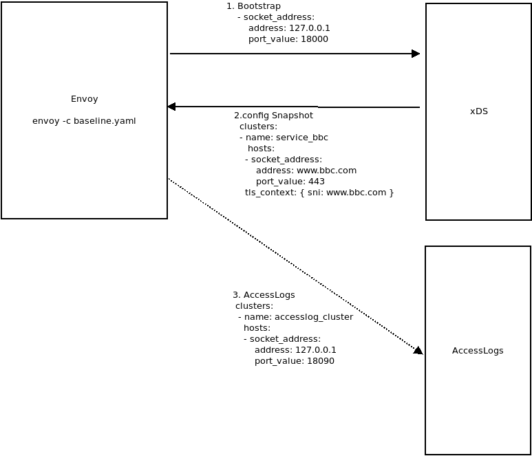
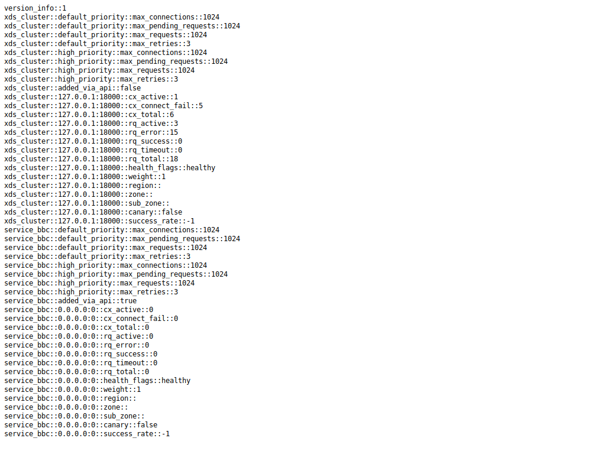

# Envoy control plane "hello world"


A couple of weeks ago i wanted to program and understand how the control plane for [Envoy Proxy](https://www.envoyproxy.io/) works.
I know its used in various comprehensive control systems like [Istio](https://www.istio.io/) and ofcourse at Lyft.

This repo/article describes a sample golang control plane for an Envoy Proxy.  It demonstrates its dynamic configuration by 
getting a specific predetetermined setting set push to each proxy at runtime.

That is, once Envoy is started, it reads in an empty configuration which only tells it where the control plane gRPC server exists.

After connecting to the control plane, it receives configuration information to setup an upstream cluster and listener set.  The 
specific listener and cluster is trivial:  it merely proxies a request for `https://www.bbc.com/robots.txt`, then after a minute, it will update the envoy config to proxy for `www.yahoo.com/robots`  then finally after another minute, `blog.salrashid.me`.

To run this sample, you need to install golang and Envoy binary itself.

[Access logging Configuration](https://www.envoyproxy.io/docs/envoy/latest/configuration/observability/access_log/usage#config-access-log)

[Access logging](https://www.envoyproxy.io/docs/envoy/latest/intro/arch_overview/observability/access_logging.html)

As a bonus, the control plane also launches an [Access Log](https://www.envoyproxy.io/docs/envoy/latest/intro/arch_overview/observability/access_logging.html) gRPC service.  This service will receives access log stats directly from the proxy. Setting up the access log is not the primary focus of this article but I'll describe it in the appendix.

> Note: much of the code and config i got here is taken from the Envoy [integration test suite](https://github.com/envoyproxy/go-control-plane/tree/master/pkg/test/main)

>>  NOTE: this repo uses the control API sas of: 
   ```docker pull envoyproxy/envoy:v1.12.2```

## Additional Reading

- [Matt Klien's blog](https://blog.envoyproxy.io/the-universal-data-plane-api-d15cec7a)
- [Envoy Configuration Guide](https://www.envoyproxy.io/docs/envoy/latest/configuration/overview/v2_overview#)
- [Envoy xDS data plane API](https://github.com/envoyproxy/data-plane-api/blob/master/XDS_PROTOCOL.md)
- [Envoy golang control plane](https://github.com/envoyproxy/go-control-plane)
- [Envoy java control plane](https://github.com/envoyproxy/java-control-plane)



---

## Setup

### Prerequisites
- Installing Go in ubuntu with this command:

``` bash
sudo apt install golang-go
```

### Start Control Plane

```
go run src/main.go
```

Which should startup the control plane, access log service and REST->gRPC gateway (the latter again not in scope of this article)

```bash
$ go run src/main.go 
INFO[0000] Starting control plane                       
INFO[0000] gateway listening HTTP/1.1                    port=18001
INFO[0000] access log server listening                   port=18090
INFO[0000] management server listening                   port=18000
```

The code is almost entirely contained in [src/main.go](src/main.go) which launches the control plane and proceeds to setup a static config to proxy to a set of `/robots.txt` files from three sites:

```golang
[]string{"www.bbc.com", "www.yahoo.com", "blog.salrashid.me"}
```

Every 60 seconds, the host will rotate over which means for the first 60 seconds, you'll see the robots.txt file from bbc, then yahoo then google.

Note, we increment the snapshot version number and the host as well:
```
$ go run src/main.go 
INFO[0000] Starting control plane                       
INFO[0000] gateway listening HTTP/1.1                    port=18001
INFO[0000] access log server listening                   port=18090
INFO[0000] management server listening                   port=18000
INFO[0003] OnStreamOpen 1 open for type.googleapis.com/envoy.api.v2.Cluster 
INFO[0003] OnStreamRequest                              
INFO[0003] cb.Report()  callbacks                        fetches=0 requests=1
INFO[0003] >>>>>>>>>>>>>>>>>>> creating cluster service_bbc  with  remoteHost%!(EXTRA string=www.bbc.com) 
INFO[0003] >>>>>>>>>>>>>>>>>>> creating listener listener_0 
INFO[0003] >>>>>>>>>>>>>>>>>>> creating snapshot Version 1 
INFO[0003] OnStreamResponse...                          
INFO[0003] cb.Report()  callbacks                        fetches=0 requests=1
INFO[0003] OnStreamRequest                              
INFO[0004] OnStreamOpen 2 open for                      
INFO[0007] OnStreamOpen 3 open for type.googleapis.com/envoy.api.v2.Listener 
INFO[0007] OnStreamRequest                              
INFO[0007] OnStreamResponse...                          
INFO[0007] cb.Report()  callbacks                        fetches=0 requests=3
INFO[0007] OnStreamRequest                              
INFO[0063] >>>>>>>>>>>>>>>>>>> creating cluster service_bbc  with  remoteHost%!(EXTRA string=www.yahoo.com) 
INFO[0063] >>>>>>>>>>>>>>>>>>> creating listener listener_0 
INFO[0063] >>>>>>>>>>>>>>>>>>> creating snapshot Version 2 
INFO[0063] OnStreamResponse...                          
INFO[0063] cb.Report()  callbacks                        fetches=0 requests=4
INFO[0063] OnStreamResponse...                          
INFO[0063] cb.Report()  callbacks                        fetches=0 requests=4
INFO[0063] OnStreamRequest                              
INFO[0063] OnStreamRequest                              
INFO[0123] >>>>>>>>>>>>>>>>>>> creating cluster service_bbc  with  remoteHost%!(EXTRA string=blog.salrashid.me) 
INFO[0123] >>>>>>>>>>>>>>>>>>> creating listener listener_0 
INFO[0123] >>>>>>>>>>>>>>>>>>> creating snapshot Version 3 
INFO[0123] OnStreamResponse...                          
INFO[0123] OnStreamResponse...                          
INFO[0123] cb.Report()  callbacks                        fetches=0 requests=6
INFO[0123] cb.Report()  callbacks                        fetches=0 requests=6
INFO[0123] OnStreamRequest                              
INFO[0123] OnStreamRequest   
```

You can review the code to see how the structure is nested and initialized.

If you just set the value to bbc and not iterate, the code will behave as if [bbc.yaml](bbc.yaml) config file was passed to envoy:

#### Create Cluster

```golang
		ctx := context.Background()
		config = cache.NewSnapshotCache(mode == Ads, Hasher{}, logger{})

		srv := xds.NewServer(ctx, config, cb)
		atomic.AddInt32(&version, 1)
		nodeId := config.GetStatusKeys()[1]

		var clusterName = "service_bbc"
		var remoteHost = "www.bbc.com"

		nodeId := config.GetStatusKeys()[0]

		var clusterName = "service_bbc"
		var remoteHost = v

		log.Infof(">>>>>>>>>>>>>>>>>>> creating cluster %v  with  remoteHost", clusterName, v)

		hst := &core.Address{Address: &core.Address_SocketAddress{
			SocketAddress: &core.SocketAddress{
				Address:  remoteHost,
				Protocol: core.SocketAddress_TCP,
				PortSpecifier: &core.SocketAddress_PortValue{
					PortValue: uint32(443),
				},
			},
		}}
		uctx := &envoy_api_v2_auth.UpstreamTlsContext{}
		tctx, err := ptypes.MarshalAny(uctx)
		if err != nil {
			panic(err)
		}

		c := []cache.Resource{
			&v2.Cluster{
				Name:                 clusterName,
				ConnectTimeout:       ptypes.DurationProto(2 * time.Second),
				ClusterDiscoveryType: &v2.Cluster_Type{Type: v2.Cluster_LOGICAL_DNS},
				DnsLookupFamily:      v2.Cluster_V4_ONLY,
				LbPolicy:             v2.Cluster_ROUND_ROBIN,
				LoadAssignment: &v2.ClusterLoadAssignment{
					ClusterName: clusterName,
					Endpoints: []*envoy_api_v2_endpoint.LocalityLbEndpoints{{
						LbEndpoints: []*envoy_api_v2_endpoint.LbEndpoint{
							{
								HostIdentifier: &envoy_api_v2_endpoint.LbEndpoint_Endpoint{
									Endpoint: &envoy_api_v2_endpoint.Endpoint{
										Address: hst,
									}},
							},
						},
					}},
				},
				TransportSocket: &core.TransportSocket{
					Name: "envoy.transport_sockets.tls",
					ConfigType: &core.TransportSocket_TypedConfig{
						TypedConfig: tctx,
					},
				},
			},
		}
```
#### Create Listener

```golang
		var listenerName = "listener_0"
		var targetHost = "www.bbc.com"
		var targetRegex = ".*"
		var virtualHostName = "local_service"
		var routeConfigName = "local_route"

		log.Infof(">>>>>>>>>>>>>>>>>>> creating listener " + listenerName)

		v := v2route.VirtualHost{
			Name:    virtualHostName,
			Domains: []string{"*"},

			Routes: []*v2route.Route{{
				Match: &v2route.RouteMatch{
					PathSpecifier: &v2route.RouteMatch_Regex{
						Regex: targetRegex,
					},
				},
				Action: &v2route.Route_Route{
					Route: &v2route.RouteAction{
						HostRewriteSpecifier: &v2route.RouteAction_HostRewrite{
							HostRewrite: targetHost,
						},
						ClusterSpecifier: &v2route.RouteAction_Cluster{
							Cluster: clusterName,
						},
						PrefixRewrite: "/robots.txt",
					},
				},
			}}}

		manager := &hcm.HttpConnectionManager{
			CodecType:  hcm.HttpConnectionManager_AUTO,
			StatPrefix: "ingress_http",
			RouteSpecifier: &hcm.HttpConnectionManager_RouteConfig{
				RouteConfig: &v2.RouteConfiguration{
					Name:         routeConfigName,
					VirtualHosts: []*v2route.VirtualHost{&v},
				},
			},
			HttpFilters: []*hcm.HttpFilter{{
				Name: wellknown.Router,
			}},
		}

		pbst, err := ptypes.MarshalAny(manager)
		if err != nil {
			panic(err)
		}

		var l = []cache.Resource{
			&v2.Listener{
				Name: listenerName,
				Address: &core.Address{
					Address: &core.Address_SocketAddress{
						SocketAddress: &core.SocketAddress{
							Protocol: core.SocketAddress_TCP,
							Address:  localhost,
							PortSpecifier: &core.SocketAddress_PortValue{
								PortValue: 10000,
							},
						},
					},
				},
				FilterChains: []*listener.FilterChain{{
					Filters: []*listener.Filter{{
						Name: wellknown.HTTPConnectionManager,
						ConfigType: &listener.Filter_TypedConfig{
							TypedConfig: pbst,
						},
					}},
				}},
			}}
```

#### Commit Snapshot

```golang
		snap := cache.NewSnapshot(fmt.Sprint(version), nil, c, nil, l, nil)
		config.SetSnapshot(nodeId, snap)
```


### Start Envoy Proxy

Now start the envoy proxy with the baseline configurtion.  Note, the config only tells envoy where to find the control plane (in this case, ```127.0.0.1:18000```)


## Acquire envoy binary `1.14.3`:

```bash
docker cp `docker create envoyproxy/envoy:v1.14.3`:/usr/local/bin/envoy .
```

At this point `/tmp/envoybin/envoy` is a binary of version `1.14.3`

Run envoy:

```
$ /tmp/envoybin/envoy -c baseline.yaml  -l debug
```

- [baseline.yaml](baseline.yaml)
```yaml
admin:
  access_log_path: /dev/null
  address:
    socket_address:
      address: 127.0.0.1
      port_value: 9000

dynamic_resources:
  ads_config:
    api_type: GRPC
    grpc_services:
    - envoy_grpc:
        cluster_name: xds_cluster
  cds_config:
    api_config_source:
      api_type: GRPC
      grpc_services:
      - envoy_grpc:
          cluster_name: xds_cluster
      set_node_on_first_message_only: true
  lds_config:
    api_config_source:
      api_type: GRPC
      grpc_services:
      - envoy_grpc:
          cluster_name: xds_cluster
      set_node_on_first_message_only: true
node:
  cluster: service_greeter
  id: test-id
static_resources:
  clusters:
  - connect_timeout: 1s
    hosts:
    - socket_address:
        address: 127.0.0.1
        port_value: 18000
    http2_protocol_options: {}
    name: xds_cluster
    type: STATIC
```

You can verify the cluster was dynamically added in by viewing the envoy admin console at ```http://localhost:9000```.  A sample output of that console:




### Access endpoint thorough proxy

we can use `localhost:10000/` to access our upstream through the proxy.  You're able to do this now because the control plane dynamically configured a cluster, listener and upstream for you on bootstrap.

### Sample output

#### curl

```
$ curl -v  localhost:10000/
Warning: Setting custom HTTP method to HEAD with -X/--request may not work the 
Warning: way you want. Consider using -I/--head instead.
*   Trying ::1...
* TCP_NODELAY set
* connect to ::1 port 10000 failed: Connection refused
*   Trying 127.0.0.1...
* TCP_NODELAY set
* Connected to localhost (127.0.0.1) port 10000 (#0)
> HEAD /robots.txt HTTP/1.1
> Host: localhost:10000
> User-Agent: curl/7.58.0
> Accept: */*
> 
< HTTP/1.1 200 OK
< server: envoy
< last-modified: Tue, 17 Apr 2018 02:18:01 GMT
< etag: "363-56a01f2964840"
< cache-control: max-age=3600, public
< content-type: text/plain
< content-length: 867
< accept-ranges: bytes
< date: Thu, 26 Apr 2018 03:22:48 GMT
< via: 1.1 varnish
< age: 4812
< x-fastly-cache-status: HIT-STALE
< x-served-by: cache-sin18028-SIN
< x-cache: HIT
< x-cache-hits: 11
< x-timer: S1524712968.404276,VS0,VE0
< vary: Accept-Encoding
< x-envoy-upstream-service-time: 220
< 
```

#### Control Plane

```
$ go run src/main.go 
INFO[0000] Starting control plane                       
INFO[0000] gateway listening HTTP/1.1                    port=18001
INFO[0000] access log server listening                   port=18090
INFO[0000] management server listening                   port=18000
INFO[0043] OnStreamOpen 1 open for                      
INFO[0043] OnStreamOpen 2 open for type.googleapis.com/envoy.api.v2.Cluster 
INFO[0043] OnStreamRequest                              
INFO[0043] open watch 1 for type.googleapis.com/envoy.api.v2.Cluster[] from nodeID "test-id", version "" 
INFO[0043] cb.Report()  callbacks                        fetches=0 requests=1
INFO[0043] >>>>>>>>>>>>>>>>>>> creating cluster service_bbc 
INFO[0043] >>>>>>>>>>>>>>>>>>> creating listener listener_0 
INFO[0043] >>>>>>>>>>>>>>>>>>> creating snapshot Version 1 
INFO[0043] respond open watch 1[] with new version "1"  
INFO[0043] respond type.googleapis.com/envoy.api.v2.Cluster[] version "" with version "1" 
INFO[0043] OnStreamResponse...                          
INFO[0043] cb.Report()  callbacks                        fetches=0 requests=1
INFO[0043] OnStreamRequest                              
INFO[0043] open watch 2 for type.googleapis.com/envoy.api.v2.Cluster[] from nodeID "test-id", version "1" 
INFO[0043] OnStreamOpen 3 open for type.googleapis.com/envoy.api.v2.Listener 
INFO[0043] OnStreamRequest                              
INFO[0043] respond type.googleapis.com/envoy.api.v2.Listener[] version "" with version "1" 
INFO[0043] OnStreamResponse...                          
INFO[0043] cb.Report()  callbacks                        fetches=0 requests=3
INFO[0043] OnStreamRequest                              
INFO[0043] open watch 3 for type.googleapis.com/envoy.api.v2.Listener[] from nodeID "test-id", version "1" 
```

#### Envoy Proxy

```
$ envoy -c baseline.yaml
[2018-04-25 20:22:10.259][158107][info][main] source/server/server.cc:178] initializing epoch 0 (hot restart version=9.200.16384.127.options=capacity=16384, num_slots=8209 hash=228984379728933363)
[2018-04-25 20:22:10.262][158107][info][upstream] source/common/upstream/cluster_manager_impl.cc:128] cm init: initializing cds
[2018-04-25 20:22:10.263][158107][info][config] source/server/configuration_impl.cc:52] loading 0 listener(s)
[2018-04-25 20:22:10.263][158107][info][config] source/server/configuration_impl.cc:92] loading tracing configuration
[2018-04-25 20:22:10.263][158107][info][config] source/server/configuration_impl.cc:119] loading stats sink configuration
[2018-04-25 20:22:10.263][158107][info][main] source/server/server.cc:353] starting main dispatch loop
[2018-04-25 20:22:10.266][158107][info][upstream] source/common/upstream/cluster_manager_impl.cc:356] add/update cluster service_bbc
[2018-04-25 20:22:10.338][158107][info][upstream] source/common/upstream/cluster_manager_impl.cc:132] cm init: all clusters initialized
[2018-04-25 20:22:10.338][158107][info][main] source/server/server.cc:337] all clusters initialized. initializing init manager
[2018-04-25 20:22:10.343][158107][info][upstream] source/server/lds_api.cc:60] lds: add/update listener 'listener_0'
[2018-04-25 20:22:10.343][158107][info][config] source/server/listener_manager_impl.cc:583] all dependencies initialized. starting workers
```

---

## AccessLog

The following config emits access_logs for upstream systems to your own endpoint.

The accesslog config is taken fron the test suite [resource.go](https://github.com/envoyproxy/go-control-plane/blob/master/pkg/test/resource/resource.go#L173
) given by the [accesslog.proto](https://github.com/envoyproxy/data-plane-api/blob/master/envoy/config/filter/accesslog/v2/accesslog.proto#L295).

Basically, when you configure a listener, you can configure a target to emit access_logs as shown below.

The sample service provided in this sample also starts a ```gRPC``` service implementing ```AccessLogService```.


- [logs.yaml](logs.yaml)

```yaml
# Base config for an ADS management server on 18000, admin port on 19000
admin:
  access_log_path: /tmp/admin_access.log
  address:
    socket_address:
      address: 127.0.0.1
      port_value: 9000

node:
  cluster: service_greeter
  id: test-id

static_resources:
  listeners:
  - name: listener_0
    address:
      socket_address: { address: 0.0.0.0, port_value: 10000 }
    filter_chains:
    - filters:
      - name: envoy.http_connection_manager
        config:
          stat_prefix: ingress_http
          codec_type: AUTO
          route_config:
            name: local_route
            virtual_hosts:
            - name: local_service
              domains: ["*"]
              routes:
              - match: { prefix: "/" }
                route: { host_rewrite: www.bbc.com, cluster: service_bbc, prefix_rewrite: "/robots.txt" }
          http_filters:
          - name: envoy.router
          access_log: 
          - name: envoy.http_grpc_access_log 
            config:
              common_config:
                grpc_service:
                  envoy_grpc:
                    cluster_name: accesslog_cluster
                log_name: accesslog
  clusters:
  - name: accesslog_cluster
    connect_timeout: 2s
    hosts:
    - socket_address:
        address: 127.0.0.1
        port_value: 18090
    http2_protocol_options: {}

  - name: service_bbc
    connect_timeout: 2s
    type: LOGICAL_DNS
    dns_lookup_family: V4_ONLY
    lb_policy: ROUND_ROBIN
    hosts: [{ socket_address: { address: bbc.com, port_value: 443 } } ]
    tls_context: { sni: www.bbc.com }
```


## Equivalent yaml configuration

The following yaml is equivalent static configurtion to what ```main.go``` does and is provided so you can compare how it gets initialized in code.

To run this config, pass ```--onlyLogging``` switch to the control plane
```
$ envoy -c logs.yaml
```

and then the control plane (which also starts the access_log server)

```
$ go run src/main.go --onlyLogging
INFO[0000] Starting control plane 
INFO[0000] access log server listening                   port=18090
```

and access the listener on 
``` 
$ curl -vk http://localhost:10000/robots.txt
```

you should see access_logs emitted to on the same stdout as before:

```bash
$ go run src/main.go --onlyLogging
INFO[0000] Starting control plane                       
INFO[0000] access log server listening                   port=18090
INFO[0005] AccessLog:  [accesslog2018-04-25T23:46:40-07:00] www.bbc.com /robots.txt https 200 3f1305d5-3616-400c-a352-93b99ff2af18 service_bbc 
INFO[0006] AccessLog:  [accesslog2018-04-25T23:46:41-07:00] www.bbc.com /robots.txt https 200 afc0ef05-feb8-4acc-beca-46c8c894eada service_bbc 
INFO[0008] AccessLog:  [accesslog2018-04-25T23:46:43-07:00] www.bbc.com /robots.txt https 200 59b53195-c0b7-47c9-a1c5-b86d3d5c1253 service_bbc 
INFO[0009] AccessLog:  [accesslog2018-04-25T23:46:45-07:00] www.bbc.com /robots.txt https 200 7cabd456-1fc1-4294-8c67-c4a6e7e4bd23 service_bbc 
```

## Conclusion

I wrote this primarly just to understand how envoy works..As this is the first time i've configured and worked through the structures within Envoy,
its very likely i've missed some construct or concept.  If you see anythign amiss, please drop me a line and I'll correct it.